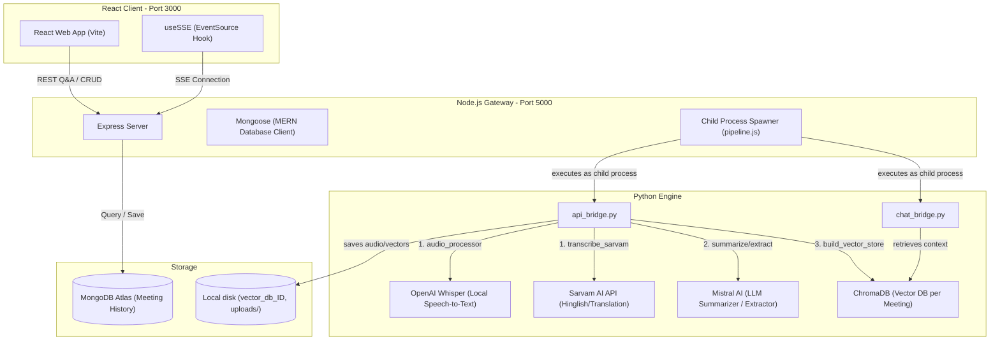
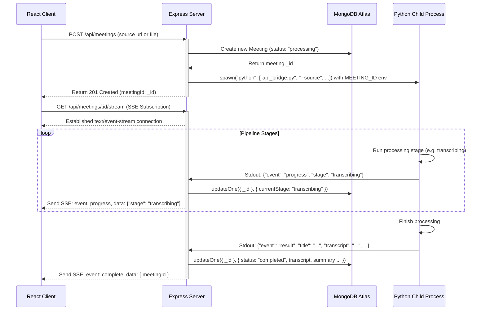

# 🎓 AI_Video_Agent — Technical Interview Preparation Guide

This guide is designed to help you prepare for technical interviews by walking through the architecture, design choices, system flows, and technical details of the **AI_Video_Agent** project.

---

## 📌 1. The 30-Second Elevator Pitch
> *"AI_Video_Agent is a full-stack MERN application that turns video links or audio uploads into meeting intelligence. It uses a **6-stage processing pipeline** (powered by OpenAI Whisper, Mistral AI, and LangChain) to generate transcripts, summaries, action items, and key decisions. It also builds an **isolated ChromaDB vector database** for each meeting, allowing users to chat with the recording via a RAG (Retrieval-Augmented Generation) interface. The app features a premium glassmorphic dark UI, supports English/Hinglish engine translation, and utilizes Server-Sent Events (SSE) to show live pipeline progress."*

---

## 🏗️ 2. System Architecture Diagrams

### A. High-Level System Architecture
This diagram illustrates the separation of concerns: React manages the UI, Node.js manages business logic and API requests, and Python runs the heavy CPU/GPU machine learning workloads.



---

### B. Detailed Process Lifecycle (Spawning and SSE)
This diagram shows how progress updates travel from Python back to the browser in real-time.



---

## 🔍 3. Core Modules & Key Files

| Module | File | Purpose & Architecture Details |
| :--- | :--- | :--- |
| **Backend** | [server.js](file:///d:/learn_ml/Gen%20ai/AI_Video_Assistant/server/server.js) | Configures Express, middleware (CORS, JSON limits), Mongoose connection, and loads routing modules. |
| **Backend** | [routes/meetings.js](file:///d:/learn_ml/Gen%20ai/AI_Video_Assistant/server/routes/meetings.js) | Handles CRUD API routes. Spawns pipeline and exposes the Server-Sent Events (SSE) `/stream` endpoint. Cleans up associated vector DB folders on document deletion. |
| **Backend** | [routes/chat.js](file:///d:/learn_ml/Gen%20ai/AI_Video_Assistant/server/routes/chat.js) | Exposes `POST /api/chat/:meetingId` which saves message logs and executes the RAG pipeline. |
| **Backend** | [services/pipeline.js](file:///d:/learn_ml/Gen%20ai/AI_Video_Assistant/server/services/pipeline.js) | Spawns standard OS sub-processes using `child_process.spawn`. Automatically injects the active database `meetingId` as the `MEETING_ID` environment variable to ensure isolated runtimes. |
| **Python** | [api_bridge.py](file:///d:/learn_ml/Gen%20ai/AI_Video_Assistant/api_bridge.py) | CLI wrapper spawned by Express. Feeds outputs to standard output (`stdout`) as JSON strings, enabling cross-runtime (Node ⇆ Python) serialization. |
| **Python** | [chat_bridge.py](file:///d:/learn_ml/Gen%20ai/AI_Video_Assistant/chat_bridge.py) | RAG CLI wrapper spawned by Express. Loads the vector store, invokes LangChain Q&A chains, and returns the generated answer in JSON format. |
| **Python** | [core/transcriber.py](file:///d:/learn_ml/Gen%20ai/AI_Video_Assistant/core/transcriber.py) | Splits audio into 25-second chunks. Routes to local OpenAI **Whisper** (English) or translate/transcribe cloud API **Sarvam AI** (Hinglish/Translation). |
| **Python** | [core/vector_store.py](file:///d:/learn_ml/Gen%20ai/AI_Video_Assistant/core/vector_store.py) | Chunking/splitting logic using `RecursiveCharacterTextSplitter`. Persists embeddings into meeting-specific subdirectories (`vector_db_<meeting_id>`). |
| **Python** | [core/rag_engine.py](file:///d:/learn_ml/Gen%20ai/AI_Video_Assistant/core/rag_engine.py) | Chains prompt templates, local retriever outputs, and ChatMistralAI together into a single pipeline using **LangChain Expression Language (LCEL)**. |
| **Frontend** | [client/src/hooks/useSSE.js](file:///d:/learn_ml/Gen%20ai/AI_Video_Assistant/client/src/hooks/useSSE.js) | Custom React hook that subscribes to the Server-Sent Events endpoint using browser `EventSource`, translating streaming events into React state updates. |

---

## 💡 4. Technical Challenges & Design Decisions

### 1. Hybrid Node-Python Spawner (Architectural "Why")
- **The Challenge**: Python is excellent for AI, ML, and data processing. JavaScript/Node.js is excellent for concurrency, database connections, and web services. A pure Python backend (like Streamlit or FastAPI) can block under long-running transcription tasks. A pure Node.js backend cannot easily run Whisper or LangChain local models without complex bindings.
- **The Design Decision**: We used **Node.js/Express as the parent controller** and **Python as the task worker**. Express spawns Python processes as background child tasks.
- **Why this works**:
  - Keeps the heavy ML CPU workloads separated from the lightweight Express event loop.
  - Allows us to easily stream logs from the child process's standard output (`stdout`) back to the client.

### 2. Live Progress Tracking via Server-Sent Events (SSE)
- **The Challenge**: A HTTP request has a timeout of ~2 minutes. Long-running tasks like download/transcribe take more than that, so a standard REST response will timeout.
- **The Design Decision**: We implemented **Server-Sent Events (SSE)** via `res.writeHead(200, { "Content-Type": "text/event-stream" })`.
- **Why this is better than WebSockets or Polling**:
  - **WebSockets** are bi-directional, complex to scale, and require specialized protocols.
  - **Polling** requires hitting the database every few seconds, generating massive HTTP request overhead.
  - **SSE** is a unidirectional, lightweight stream running over standard HTTP, supported natively by browsers (`EventSource`). It is perfect for streaming progress notifications.

### 3. Isolated Multi-Meeting Databases & Automated Cleanups
- **The Challenge**: In the original CLI, ChromaDB used a single persistent directory `vector_db` with a single collection. In a multi-user, multi-meeting web app, this would merge everyone's transcripts, causing the chatbot to return context from other meetings.
- **The Design Decision**: We designed **Isolated Database Paths**. 
  - Express spawns processes passing `MEETING_ID` in the `env` dictionary.
  - Python reads `os.getenv("MEETING_ID")` and dynamically initializes the database in `vector_db_<meeting_id>`.
  - When a user deletes a meeting, Express uses `fs.rmSync` to delete the specific `vector_db_<meeting_id>` folder on disk, preventing storage leaks.

### 4. Windows Codec & Unicode Printing Issues
- **The Challenge**: When a Python child process prints characters like emojis (`❌`) or arrows (`→`) to `sys.stdout` on Windows, it crashes with:
  `UnicodeEncodeError: 'charmap' codec can't encode character...`
  This happens because Windows command shells default to `cp1252` encoding, which does not support these characters.
- **The Design Decision**: 
  - Replaced all raw console-print unicode symbols with ASCII equivalents (e.g. `→` with `->`, `❌` with `[ERROR]`).
  - Ensured all JSON structures output through `json.dumps()` use standard character escapes (`ensure_ascii=True` is active by default), keeping stdout fully ASCII-safe.

### 5. Parallel Mongoose Document Writes
- **The Challenge**: Under heavy logging loads, Mongoose threw errors like `VersionError: No matching document found` or `Can't save() the same doc multiple times in parallel`. This happened because Express was trying to call `.save()` on a single mongoose model instance simultaneously as progress events fired.
- **The Design Decision**: Replaced model instance `.save()` calls in the progress handler with atomic database updates:
  ```javascript
  await Meeting.updateOne(
    { _id: meeting._id },
    { $set: { currentStage: evt.stage } }
  );
  ```
  This skips Mongoose model version validation, updating only the specific field directly in MongoDB.

### 6. Dynamic FFmpeg Environment Injection
- **The Challenge**: Local Whisper transcriptions require the `ffmpeg` tool to convert audio, but users may not have FFmpeg added to their global system PATH.
- **The Design Decision**: Prepend the user's local FFmpeg path directly to `os.environ["PATH"]` at the very start of the Python scripts.
  ```python
  FFMPEG_PATH = r"C:\Users\abhis\Downloads\ffmpeg-8.1.1-essentials_build\ffmpeg-8.1.1-essentials_build\bin"
  if FFMPEG_PATH not in os.environ.get("PATH", ""):
      os.environ["PATH"] = FFMPEG_PATH + os.pathsep + os.environ.get("PATH", "")
  ```
  This creates a self-contained environment where the code runs successfully out-of-the-box.

---

## 💬 5. Expected Technical Interview Questions

#### Q1: What is RAG, and how is it used in your project?
> **Answer**: RAG stands for Retrieval-Augmented Generation. In my project, it allows users to chat with their meeting. Instead of sending the entire transcript (which might exceed LLM context windows or cost too many tokens) to the model, I chunk the transcript into 500-character blocks, create embeddings using Hugging Face, and store them in ChromaDB. When a user asks a question, we retrieve the top 4 most relevant chunks, inject them as context into the prompt, and ask Mistral AI to answer based *only* on that context.

#### Q2: Why did you use Server-Sent Events (SSE) instead of WebSockets?
> **Answer**: WebSockets are great for bi-directional communication (like real-time multiplayer games or chat). However, my pipeline is unidirectional: the backend needs to push updates *to* the client, but the client doesn't need to send streaming data back to the server. SSE is built directly on HTTP, works out of the box with standard load balancers, automatically handles reconnection, and uses a very simple browser API (`EventSource`), making it the optimal choice for progress tracking.

#### Q3: How did you scale the vector store to support multiple meetings?
> **Answer**: Originally, the database was stored in a single folder which caused transcripts to mix. I modified the database storage layout so that each meeting has a directory named `vector_db_<meeting_id>`. When launching a query, Node.js passes the `meetingId` as an environment variable to the Python runtime, ensuring that the Q&A engine only retrieves context from that specific meeting's directory. Additionally, we automatically delete these directories from disk when a meeting is deleted.

#### Q4: How did you handle errors in spawned child processes?
> **Answer**: I set up listeners on both `stdout` and `stderr` streams of the spawned child process. Stdout handles the progress tracking by parsing JSON events. If the process terminates with a non-zero exit code, we capture all logs collected in `stderr` and pass them to our Express `onError` callback. The server logs the full traceback in the terminal, saves the error message in MongoDB, updates the status to `"failed"`, and notifies the frontend via SSE.

#### Q5: Why does Whisper transcription take a long time on your system, and how would you optimize it?
> **Answer**: By default, Whisper runs locally on the CPU (using the `"small"` model). Because CPU calculations are sequential compared to highly parallel GPU computations, transcription of a 10-minute meeting can take several minutes.
> **To optimize this, I would**:
> 1. Leverage **GPU acceleration** (using CUDA) if a GPU is available.
> 2. Implement **Whisper C++ binding versions** (`whisper.cpp`) or **Faster-Whisper**, which uses CTranslate2 to run up to 4x faster with less memory.
> 3. Migrate the local models to a hosted serverless API (such as Groq or OpenAI Whisper API) if production speed is critical.
