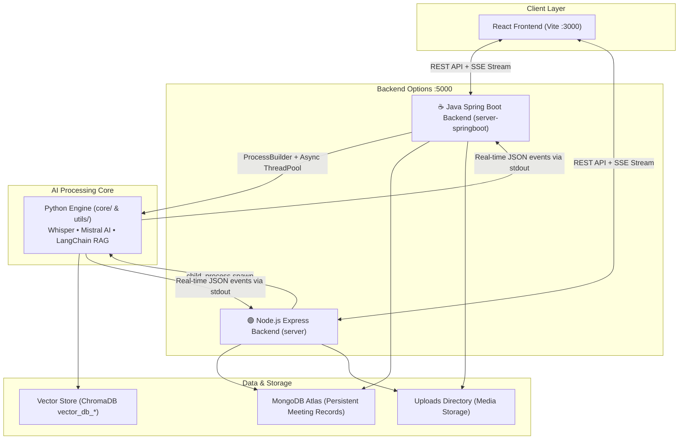

# 🚀 AI_Video_Agent — Meeting Intelligence Platform

AI_Video_Agent is an enterprise-grade meeting intelligence platform that transforms long meeting recordings or YouTube links into structured intelligence summaries, actionable items, and an interactive Q&A chatbot using **LangChain RAG (Retrieval-Augmented Generation)**.

The platform features a **Dual-Backend Architecture**, allowing developers to run the system with an enterprise **Java Spring Boot 3 Backend** (`server-springboot`) or a lightweight **Node.js Express Backend** (`server`).

---

## 📸 Interface Preview
*Featuring a premium, glassmorphic dark-theme UI with electric-violet and cyan accents.*

---

## 🏗️ Architecture Flow



### ⚡ Enterprise Hybrid Design
- **Java Spring Boot 3 (Primary Enterprise Backend)**: Implements clean layered architecture (Controller, Service, Repository, DTO), asynchronous multithreading with `ThreadPoolTaskExecutor`, thread-safe Server-Sent Events (`SseEmitter`), Swagger/OpenAPI documentation, and full JUnit 5 / Mockito test coverage.
- **Node.js/Express (Alternative MERN Backend)**: Lightweight event-driven API gateway and file manager.
- **Python Core**: Hosts the heavy AI processing pipeline (OpenAI Whisper STT, Sarvam AI, Mistral AI, ChromaDB, HuggingFace embeddings). Spawned asynchronously with real-time stdout streaming relayed to the React client via **Server-Sent Events (SSE)**.

---

## 🌟 Key Features

- **🛸 Premium Dark UI**: Frosted glassmorphism design with fluid hover cards, responsive grid, and clean layouts.
- **📈 6-Stage AI Pipeline**:
  1. **Audio Extraction**: Converts video formats or downloads YouTube links using `yt-dlp` and `pydub`.
  2. **Transcription Engine**: Speech-to-text with local **Whisper** (English) or **Sarvam AI** cloud (Hinglish/Translation).
  3. **Title Generation**: Automated title creation based on discussion topics.
  4. **Bullet Summarization**: Summarizes transcripts into structured professional logs.
  5. **Insight Extraction**: Extracts actionable items, decisions, and follow-up open questions.
  6. **RAG Database Building**: Sets up an isolated vector database using **ChromaDB** and HuggingFace embeddings.
- **💬 Isolated Q&A Chatbot**: Chat with your meeting transcript. Each meeting is allocated an isolated database (`vector_db_<meeting_id>`) to prevent information cross-contamination.
- **🗑️ Database Auto-Cleanup**: Automatically deletes the associated vector database directories on disk when a meeting is deleted.
- **📖 Interactive API Docs**: Swagger OpenAPI 3 UI interactive test bench at `http://localhost:5000/swagger-ui.html`.

---

## 🛠️ Tech Stack

### Java Spring Boot Backend (`server-springboot/`)
- **Framework**: Java 21 / 22, Spring Boot 3.4.3
- **Modules**: Spring Web MVC, Spring Data MongoDB, Spring Validation, SpringDoc OpenAPI 3 (Swagger UI)
- **Concurrency**: Spring `@Async` with `ThreadPoolTaskExecutor` (bounded thread pool)
- **Streaming**: Spring MVC `SseEmitter` with thread-safe client registry
- **Process Orchestration**: Java `ProcessBuilder` with non-blocking stream readers
- **Testing**: JUnit 5, Mockito, Spring Boot Test (`MockMvc`, `WebMvcTest`)
- **Build Tool**: Apache Maven (includes Maven Wrapper `mvnw` & `mvnw.cmd`)

### Frontend (`client/`)
- React 18 (Vite), Framer Motion, Lucide Icons, Axios, EventSource (SSE)

### Python AI Core
- Python 3.12, LangChain (LCEL), Mistral AI API, Sarvam AI API, OpenAI Whisper, ChromaDB, Pydub, yt-dlp

---

## 🚦 Getting Started

### 📋 Prerequisites
1. **JDK 17+** (JDK 21 or 22 recommended)
2. **Node.js** (v18+)
3. **Python** (v3.9+) with virtual environment activated
4. **MongoDB** (Atlas connection URI or local instance)
5. **FFmpeg** installed (Whisper and Pydub dependency)

---

### 📦 Installation

1. **Clone the Repository**:
   ```bash
   git clone https://github.com/dhangar007A/AI-Video-Assistant.git
   cd AI-Video-Assistant
   ```

2. **Configure Python Environment**:
   ```bash
   python -m venv .venv
   # Windows Activation:
   .venv\Scripts\activate
   # macOS/Linux Activation:
   source .venv/bin/activate

   pip install -r Requirements.txt
   ```

3. **Configure Environment Variables**:
   In root `.env`:
   ```env
   MISTRAL_API_KEY="your_mistral_api_key"
   SARVAM_API_KEY="your_sarvam_api_key"
   WHISPER_MODEL="small"
   SARVAM_STT_MODEL="saaras:v2.5"
   ```

---

### 🚀 Running the App

#### Option A: Running with the Java Spring Boot Backend (Recommended)

1. **Start Spring Boot**:
   ```powershell
   cd server-springboot

   # On Windows (cmd or powershell):
   .\run.cmd
   # Or using the Maven Wrapper directly:
   .\mvnw.cmd spring-boot:run
   ```
   *Runs on `http://localhost:5000`*
   *Access Swagger UI at `http://localhost:5000/swagger-ui.html`*

2. **Run Unit Tests**:
   ```powershell
   cd server-springboot
   .\mvnw.cmd test
   ```

3. **Start the React Frontend**:
   ```bash
   cd client
   npm install
   npm run dev
   ```
   *Runs on `http://localhost:3000`*

---

#### Option B: Running with the Node.js Backend

1. **Start Express Server**:
   ```bash
   cd server
   npm install
   npm start
   ```
   *Runs on `http://localhost:5000`*

2. **Start the React Frontend**:
   ```bash
   cd client
   npm run dev
   ```

---

## 📡 REST API Documentation

| Method | Endpoint | Description |
| :--- | :--- | :--- |
| `POST` | `/api/meetings` | Submit YouTube URL (JSON) or Upload media file (Multipart) |
| `GET` | `/api/meetings` | List all meetings (lightweight summary projection) |
| `GET` | `/api/meetings/{id}` | Get full meeting intelligence details |
| `GET` | `/api/meetings/{id}/stream` | Server-Sent Events (SSE) real-time pipeline progress |
| `DELETE`| `/api/meetings/{id}` | Delete meeting and erase Chroma vector store from disk |
| `POST` | `/api/chat/{meetingId}` | Conversational RAG Q&A query against meeting transcript |
| `GET` | `/api/chat/{meetingId}/history` | Get chat history for a meeting |
| `GET` | `/api/health` | Backend health check and service metadata |

---

## 🏛️ Architecture & Interview Guide
For in-depth explanations of design patterns, concurrency models, Spring Data MongoDB configurations, and MoveInSync / WorkInSync interview talking points, refer to [SPRINGBOOT_ARCHITECTURE.md](SPRINGBOOT_ARCHITECTURE.md).
